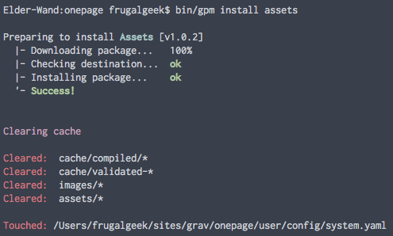

# Grav Assets Plugin


`assets` is a [Grav](http://github.com/getgrav/grav) plugin that provides a convenient way to add CSS and JS assets directly from your pages.

# Installation

Installing the Assets plugin can be done in one of two ways. Our GPM (Grav Package Manager) installation method enables you to quickly and easily install the plugin with a simple terminal command, while the manual method enables you to do so via a zip file. 

## GPM Installation (Preferred)



The simplest way to install this plugin is via the [Grav Package Manager (GPM)](http://learn.getgrav.org/advanced/grav-gpm) through your system's Terminal (also called the command line).  From the root of your Grav install type:

    bin/gpm install assets

This will install the Assets plugin into your `/user/plugins` directory within Grav. Its files can be found under `/your/site/grav/user/plugins/assets`.

## Manual Installation

To install this plugin, just download the zip version of this repository and unzip it under `/your/site/grav/user/plugins`. Then, rename the folder to `assets`. You can find these files either on [GitHub](https://github.com/getgrav/grav-plugin-assets) or via [GetGrav.org](http://getgrav.org/downloads/plugins#extras).

You should now have all the plugin files under

    /your/site/grav/user/plugins/assets

>> NOTE: This plugin is a modular component for Grav which requires [Grav](http://github.com/getgrav/grav), the [Error](https://github.com/getgrav/grav-plugin-error) and [Problems](https://github.com/getgrav/grav-plugin-problems) plugins, and a theme to be installed in order to operate.

# Config Defaults

```
enabled: true
```

If you need to change any value, then the best process is to copy the [assets.yaml](assets.yaml) file into your `users/config/plugins/` folder (create it if it doesn't exist), and then modify there.  This will override the default settings.

# Usage

Once the plugin is installed you can use the following syntax to add various asset types, where default order is 10 for `js` and `css` types:

```
{assets:css order:5}
custom-style.css
/blog/some-blog/post/style.css
//cdnjs.cloudflare.com/ajax/libs/1140/2.0/1140.css
http://somesite.com/js/cookies.min.css
{/assets}

{assets:js order:10}
custom-script.js
/blog/some-blog/post/script.js
//cdnjs.cloudflare.com/ajax/libs/1140/2.0/1140.min.js
http://somesite.com/js/cookies.min.js
{/assets}

{assets:inline_css}
h1 {color: red !important;}
{/assets}

{assets:inline_js}
  function initialize() {
    var mapCanvas = document.getElementById('map_canvas');
    var mapOptions = {
      center: new google.maps.LatLng(44.5403, -78.5463),
      zoom: 8,
      mapTypeId: google.maps.MapTypeId.ROADMAP
    }
    var map = new google.maps.Map(mapCanvas, mapOptions);
  }
{/assets}
```

> Note: If you want to see this plugin in action, have a look at [Grav Learn Site](http://learn.getgrav.org)

# Updating

As development for the Assets plugin continues, new versions may become available that add additional features and functionality, improve compatibility with newer Grav releases, and generally provide a better user experience. Updating Assets is easy, and can be done through Grav's GPM system, as well as manually.

## GPM Update (Preferred)

The simplest way to update this plugin is via the [Grav Package Manager (GPM)](http://learn.getgrav.org/advanced/grav-gpm). You can do this with this by navigating to the root directory of your Grav install using your system's Terminal (also called command line) and typing the following:

    bin/gpm update assets

This command will check your Grav install to see if your Assets plugin is due for an update. If a newer release is found, you will be asked whether or not you wish to update. To continue, type `y` and hit enter. The plugin will automatically update and clear Grav's cache.

## Manual Update

Manually updating Assets is pretty simple. Here is what you will need to do to get this done:

* Delete the `your/site/user/plugins/assets` directory.
* Downalod the new version of the Assets plugin from either [GitHub](https://github.com/getgrav/grav-plugin-assets) or [GetGrav.org](http://getgrav.org/downloads/plugins#extras).
* Unzip the zip file in `your/site/user/plugins` and rename the resulting folder to `assets`.
* Clear the Grav cache. The simplest way to do this is by going to the root Grav directory in terminal and typing `bin/grav clear-cache`.

> Note: Any changes you have made to any of the files listed under this directory will also be removed and replaced by the new set. Any files located elsewhere (for example a YAML settings file placed in `user/config/plugins`) will remain intact.
